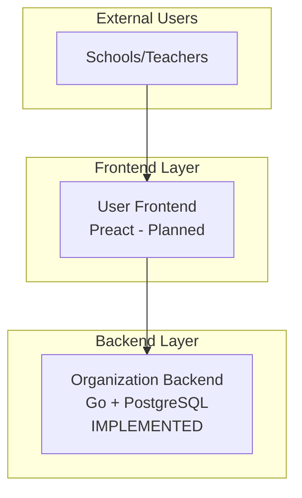

# User Frontend Implementation Plan

## Overview

The User Frontend is the interface for schools/teachers to browse first aid training materials, create rental requests, and track their orders. It connects to the **Organization Backend** (orgbackend) which is already implemented in Go.

## Architecture Context



## Backend API Reference

The orgbackend provides the following REST endpoints and SSE streams:

### REST Endpoints

| Method | Endpoint | Description |
|--------|----------|-------------|
| POST | `/requests` | Create a new request with items |
| GET | `/requests` | List requests with pagination, search, filters |
| GET | `/requests/{id}` | Get a specific request by ID |

### SSE (Server-Sent Events) Endpoints

| Method | Endpoint | Description |
|--------|----------|-------------|
| GET | `/requests/{id}/subscribe` | Subscribe to real-time updates for a request |
| GET | `/requests/subscribe` | Subscribe to real-time updates for list queries |

### Query Parameters for List Requests

- `q` - Search query (matches customer name, email, or request ID)
- `limit` - Number of results per page (default: 20)
- `cursor` - Pagination cursor
- `status` - Filter by status: `pending`, `inAction`, `returned`
- `customerId` - Filter by customer ID
- `from` - Filter by delivery date (ISO 8601)
- `to` - Filter by delivery date (ISO 8601)

### Data Models

#### Request
```typescript
interface Request {
  id: string;
  customer: Customer;
  items: Record<string, number>;  // materialTypeId -> quantity
  deliveryDate: string;  // ISO 8601
  status: 'pending' | 'inAction' | 'returned';
  shippingCustomerName: string;
  shippingAddress: ShippingAddress;
  createdAt: string;
  updatedAt: string;
  metadata?: Record<string, any>;
}

interface Customer {
  id: string;
  email: string;
  name: string;
  token: string;
  createdAt: string;
}

interface ShippingAddress {
  line1: string;
  line2?: string;
  city: string;
  zipCode: string;
}
```

#### Create Request Payload
```typescript
interface CreateRequestPayload {
  customerEmail: string;
  customerName: string;
  deliveryDate: string;  // ISO 8601
  status?: string;
  shippingCustomerName: string;
  shippingAddress: {
    line1: string;
    line2?: string;
    city: string;
    zipCode: string;
  };
  items: Record<string, number>;
  metadata?: Record<string, any>;
}
```

## Material Catalog

The platform manages first aid training materials in three categories:

### Reanimation (Resuscitation)
| Material ID | Name |
|-------------|------|
| `AED_Trainer` | AED Trainer |
| `Laerdal_Family_Satz` | Laerdal Family Set |
| `Mini-Anne_10er` | Mini-Anne 10-pack |
| `Mini-Anne_einzeln` | Mini-Anne Single |
| `QCPR_Junior_Puppe-4er` | QCPR Junior Puppet 4-pack |
| `QCPR_Junior_Puppe` | QCPR Junior Puppet |
| `QCPR_Little_Anne` | QCPR Little Anne |

### Wundversorgung & Trauma (Wound Care & Trauma)
| Material ID | Name |
|-------------|------|
| `Dreieckstuch` | Triangular Bandage |
| `Fixierbinde` | Fixation Bandage |
| `Rettungsdecke` | Emergency Blanket |
| `Sterile_Kompressen-10x10` | Sterile Compresses 10x10 |
| `Tourniquet` | Tourniquet |

### Zubehoer (Accessories)
| Material ID | Name |
|-------------|------|
| `Airwaykopf` | Airway Head |
| `Apollo_Uebungsmatte` | Apollo Training Mat |

## Pages & Routes

Based on the demo frontend and backend capabilities:

### 1. Material Catalog (`/materials`)
**Purpose**: Browse and search available training materials

**Features**:
- Product grid displaying all materials with images
- Category filters (Reanimation, Wundversorgung & Trauma, Zubehoer)
- Search functionality
- Add to cart functionality
- Material detail modal/view

**Backend Integration**: None (static catalog, images from `frontend/demo/user/assets/`)

**State Management**:
- Cart items (localStorage)
- Selected filters
- Search query

### 2. My Requests (`/requests`)
**Purpose**: View and track all requests made by the customer

**Features**:
- List of all requests with status badges
- Filter by status (pending, inAction, returned)
- Date range filtering
- Real-time status updates via SSE
- Request detail view
- Cancel pending requests

**Backend Integration**:
- `GET /requests?customerId={id}` - List customer's requests
- `GET /requests/subscribe?customerId={id}` - Live updates

**State Management**:
- Request list
- Filter state
- SSE connection

### 3. Request Cart (`/cart`)
**Purpose**: Review and submit material requests

**Features**:
- Review cart items with quantities
- Set delivery date
- Enter shipping address
- Add notes/metadata
- Submit request
- Save as draft

**Backend Integration**:
- `POST /requests` - Create the request

**State Management**:
- Cart items (localStorage)
- Form state
- Submission status

### 4. Request Detail (`/requests/:id`)
**Purpose**: View detailed information about a specific request

**Features**:
- Full request information
- Real-time status updates
- Item list with quantities
- Shipping address
- Timeline/history

**Backend Integration**:
- `GET /requests/{id}` - Get request details
- `GET /requests/{id}/subscribe` - Live updates

**State Management**:
- Request data
- SSE connection

### 5. Profile (`/profile`)
**Purpose**: Manage user account settings

**Features**:
- View/edit customer info
- Default shipping address
- Notification preferences

**Backend Integration**: None initially (customer data comes from request responses)

**State Management**:
- Customer profile (localStorage)

## Component Structure

```
frontend/user/
├── src/
│   ├── components/
│   │   ├── Layout/
│   │   │   ├── Header.tsx
│   │   │   ├── Sidebar.tsx
│   │   │   └── Footer.tsx
│   │   ├── Material/
│   │   │   ├── MaterialCard.tsx
│   │   │   ├── MaterialGrid.tsx
│   │   │   ├── MaterialFilter.tsx
│   │   │   └── MaterialDetailModal.tsx
│   │   ├── Request/
│   │   │   ├── RequestCard.tsx
│   │   │   ├── RequestList.tsx
│   │   │   ├── RequestFilter.tsx
│   │   │   ├── RequestDetail.tsx
│   │   │   └── StatusBadge.tsx
│   │   ├── Cart/
│   │   │   ├── CartItem.tsx
│   │   │   ├── CartSummary.tsx
│   │   │   ├── AddressForm.tsx
│   │   │   └── DatePicker.tsx
│   │   └── common/
│   │       ├── Button.tsx
│   │       ├── Input.tsx
│   │       ├── Select.tsx
│   │       ├── Loading.tsx
│   │       └── ErrorBoundary.tsx
│   ├── hooks/
│   │   ├── useApi.ts
│   │   ├── useSse.ts
│   │   ├── useCart.ts
│   │   ├── useRequests.ts
│   │   └── useLocalStorage.ts
│   ├── services/
│   │   ├── api.ts
│   │   ├── sse.ts
│   │   └── materialCatalog.ts
│   ├── types/
│   │   ├── request.ts
│   │   ├── customer.ts
│   │   ├── material.ts
│   │   └── api.ts
│   ├── utils/
│   │   ├── formatters.ts
│   │   ├── validators.ts
│   │   └── constants.ts
│   ├── pages/
│   │   ├── MaterialsPage.tsx
│   │   ├── RequestsPage.tsx
│   │   ├── RequestDetailPage.tsx
│   │   ├── CartPage.tsx
│   │   └── ProfilePage.tsx
│   ├── App.tsx
│   ├── main.tsx
│   └── index.css
├── public/
│   └── assets/
│       └── material/           # Copy from demo
├── index.html
├── package.json
├── tsconfig.json
├── vite.config.ts
└── tailwind.config.js
```

## Technology Stack

- **Framework**: Preact (React alternative for smaller bundle)
- **Build Tool**: Vite
- **Routing**: preact-iso or preact-router
- **Styling**: Tailwind CSS (matches demo styling patterns)
- **State Management**: Signals (@preact/signals) for local state
- **API Client**: Native fetch with custom wrapper
- **SSE**: Native EventSource with reconnection logic

## Key Implementation Details

### 1. Cart Management
- Persist cart to localStorage
- Structure: `Record<materialId, { quantity: number, addedAt: string }>`
- Sync across tabs using storage events

### 2. SSE Integration
- Custom hook `useSse` for managing EventSource connections
- Automatic reconnection with exponential backoff
- Handle connection errors gracefully
- Unsubscribe on component unmount

### 3. Authentication
- Token-based authentication (customer token from backend)
- Store token in localStorage
- Include token in request headers: `Authorization: Bearer {token}`

### 4. Error Handling
- API errors: Display user-friendly messages
- Network errors: Retry with backoff
- SSE errors: Attempt reconnection
- Validation errors: Show field-level errors

### 5. Responsive Design
- Mobile-first approach
- Sidebar becomes drawer on mobile
- Grid adjusts columns based on viewport
- Touch-friendly controls

## API Service Implementation

```typescript
// services/api.ts
const API_BASE = import.meta.env.VITE_API_URL || 'http://localhost:8080';

class ApiService {
  async createRequest(payload: CreateRequestPayload): Promise<Request> {
    const res = await fetch(`${API_BASE}/requests`, {
      method: 'POST',
      headers: { 'Content-Type': 'application/json' },
      body: JSON.stringify(payload),
    });
    if (!res.ok) throw new Error('Failed to create request');
    return res.json();
  }

  async getRequest(id: string): Promise<Request> {
    const res = await fetch(`${API_BASE}/requests/${id}`);
    if (!res.ok) throw new Error('Request not found');
    return res.json();
  }

  async listRequests(params: ListParams): Promise<ListResult<Request>> {
    const query = new URLSearchParams();
    if (params.customerId) query.set('customerId', params.customerId);
    if (params.status) query.set('status', params.status);
    if (params.limit) query.set('limit', String(params.limit));
    if (params.cursor) query.set('cursor', params.cursor);
    if (params.q) query.set('q', params.q);
    
    const res = await fetch(`${API_BASE}/requests?${query}`);
    if (!res.ok) throw new Error('Failed to list requests');
    return res.json();
  }
}
```

## SSE Service Implementation

```typescript
// services/sse.ts
class SseService {
  private eventSource: EventSource | null = null;
  private reconnectAttempts = 0;
  private maxReconnectAttempts = 5;

  subscribeToRequest(requestId: string, onUpdate: (data: any) => void) {
    const url = `${API_BASE}/requests/${requestId}/subscribe`;
    this.connect(url, onUpdate);
  }

  subscribeToList(params: ListParams, onUpdate: (data: any) => void) {
    const query = new URLSearchParams();
    if (params.customerId) query.set('customerId', params.customerId);
    // ... other params
    const url = `${API_BASE}/requests/subscribe?${query}`;
    this.connect(url, onUpdate);
  }

  private connect(url: string, onUpdate: (data: any) => void) {
    this.eventSource = new EventSource(url);
    
    this.eventSource.onmessage = (event) => {
      const data = JSON.parse(event.data);
      onUpdate(data);
      this.reconnectAttempts = 0;
    };

    this.eventSource.onerror = () => {
      this.eventSource?.close();
      if (this.reconnectAttempts < this.maxReconnectAttempts) {
        setTimeout(() => this.connect(url, onUpdate), 
          Math.pow(2, this.reconnectAttempts) * 1000);
        this.reconnectAttempts++;
      }
    };
  }

  disconnect() {
    this.eventSource?.close();
    this.eventSource = null;
  }
}
```

## Styling Guidelines

Based on the demo styles:

- **Primary Color**: `#ff9900` (orange)
- **Secondary Color**: `#232f3e` (dark blue-gray)
- **Background**: `#f5f5f5` (light gray)
- **Card Background**: `#ffffff`
- **Text Primary**: `#333333`
- **Text Secondary**: `#666666`

### Status Badge Colors
- `pending`: Yellow/Orange
- `inAction`: Blue
- `returned`: Green

## Build & Development

```bash
# Install dependencies
npm install

# Development server
npm run dev

# Build for production
npm run build

# Preview production build
npm run preview
```

## Environment Variables

```
VITE_API_URL=http://localhost:8080
VITE_APP_NAME=EHALP
```

## Future Enhancements

1. **Offline Support**: Cache material catalog with Service Worker
2. **Push Notifications**: For request status updates
3. **Multi-language**: i18n support (German/English)
4. **Request Templates**: Save common request configurations
5. **Calendar Integration**: Export delivery dates
